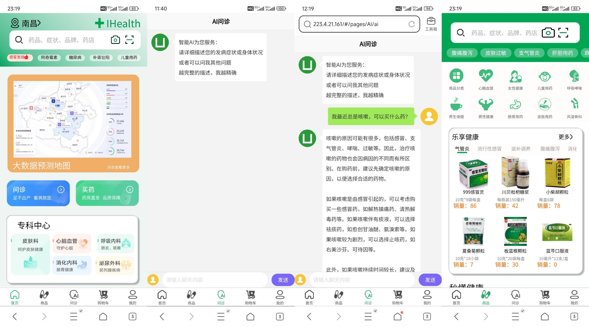
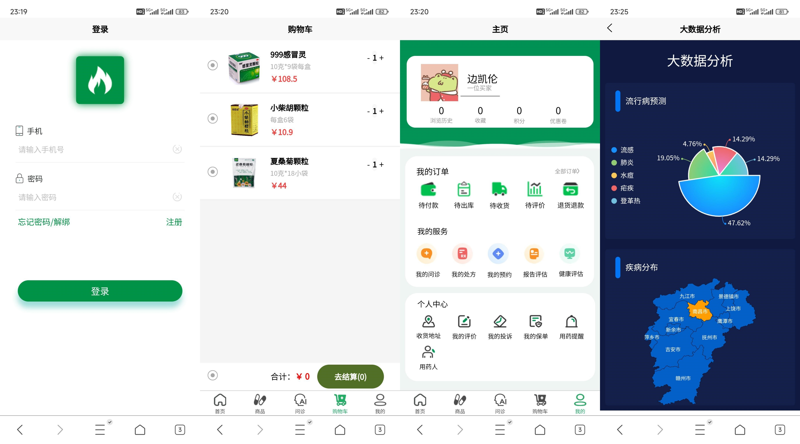
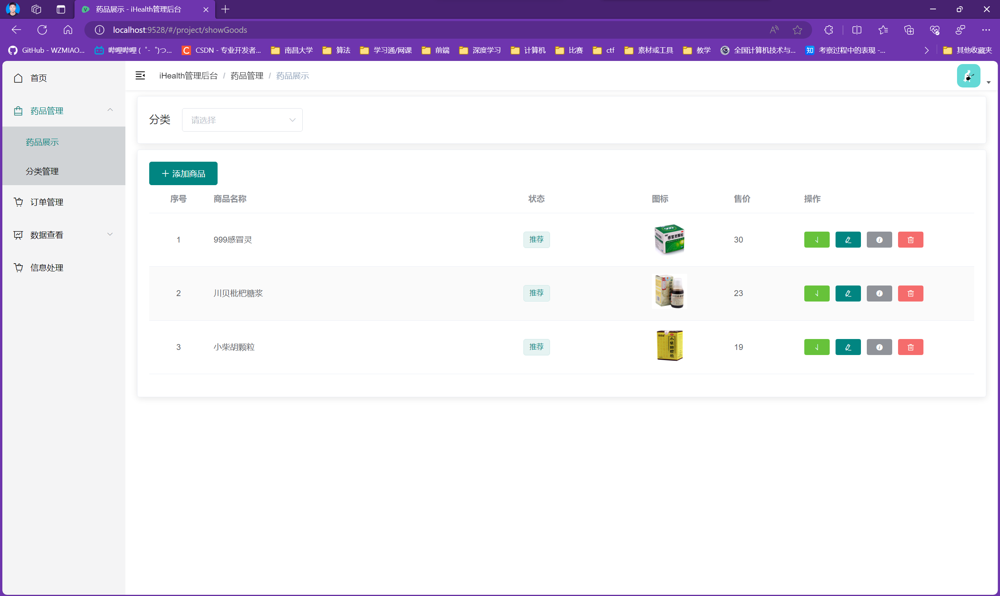
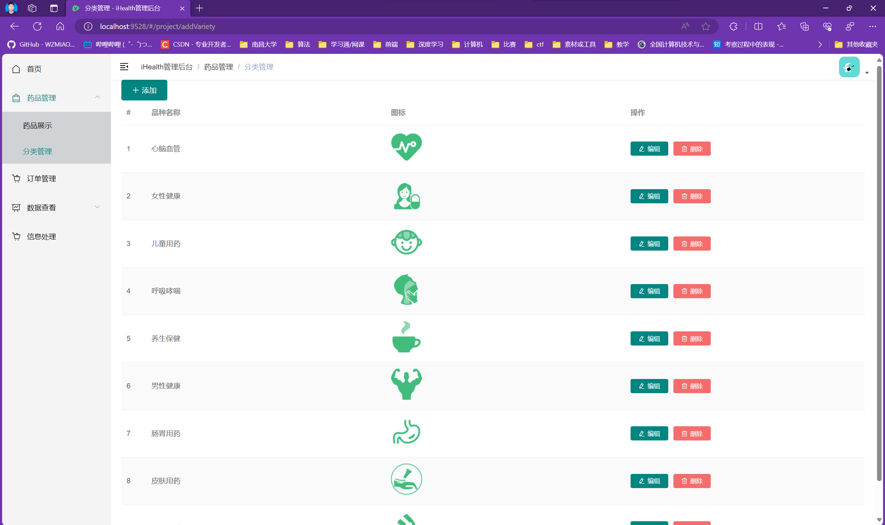

# iHealth智能药店

iHealth是一款融合先进科技与医疗关怀的医药服务平台，致力于让用户**享受便利的购药体验**、**获取精准的问诊结果**、**查看实时的疾病风险预警**，并**提供个性化的医疗服务**。通过整合AI和大数据技术，解决购药时空限制、医疗资源分布不均、信息不透明等问题。

## 大模型使用百度ERNIE-3.5-8K
## 阿里云服务器已停机









### 项目介绍及说明

1. 项目组成及说明

|            |           说明           |
| :--------: | :----------------------: |
|  **前台**  |        买家用户端        |
|  **后台**  |        商家管理端        |
|  **后端**  | 处理用户请求，调取数据库 |
| **数据库** |       存储用户信息       |


2.项目开发工具技术

|            |          开发工具          |           技术           |
| :--------: | :------------------------: | :----------------------: |
|  **前台**  | HBuilder X、微信开发者工具 |       uniapp、Vue        |
|  **后台**  |           VScode           |     Vue、Element-UI      |
|  **后端**  |       intelliJ IDEA        | SpringBoot、Mybatis-Plus |
| **数据库** |          Navicat           |          MySQL           |


### 项目部署与展示

*本项目前台、后端、数据库已经部署到阿里云服务器（7.19日停机）*

1. [前台](http://120.55.189.10/)  
   - 网址：223.4.21.161      *建议使用手机浏览器打开h5页面*
   
   - 账号：123
   - 密码：123
2. [后端API文档](http://120.55.189.10:8081/swagger-ui.html#/hello/picUsingGET)
   - 网址：http://223.4.21.161:8081/swagger-ui.html#/hello/picUsingGET
3. 数据库访问

   - 主机：223.4.21.161
   - 端口：3306
   - 用户名：root
   - 库名：drug


###  安装使用教程

1.  前台
    1. 使用HBuilder X打开项目文件夹
    2. 点击运行，可以选择浏览器（h5）、小程序（需要安装微信开发者工具）、手机（需要下载安卓模拟器）
2.  后台
    1. 安装Node.js，版本：16.17.0
    2. 使用VScode打开项目文件夹  

```shell
# 安装依赖
npm install

# 启动项目
npm run dev
```

3. 后端
   - jdk：17.0.2
   - maven：3.6.1
   - spring boot：2.7.16
   - 在IDEA中运行DemoApplication.java        *前提数据库配置完成*
   - 项目运行后查看swagger-ui文档：http://localhost:8081/swagger-ui.html#/hello/picUsingGET
4. 数据库
   - 创建Mysql数据库
   - 用户root，密码winner.123
   - 建库drug
   - 导入iHealth_localhost.sql
   - *或者在后端application.yml文件中可以修改为自己的数据库信息*
5. 阿里云服务器
   - 使用Xshell 连接
   - 协议：SSH
   - 主机：223.4.21.161
   - 端口号：22
   - 选择用户身份验证
   - 账号：root
   - 项目位置：/usr/app/dist
